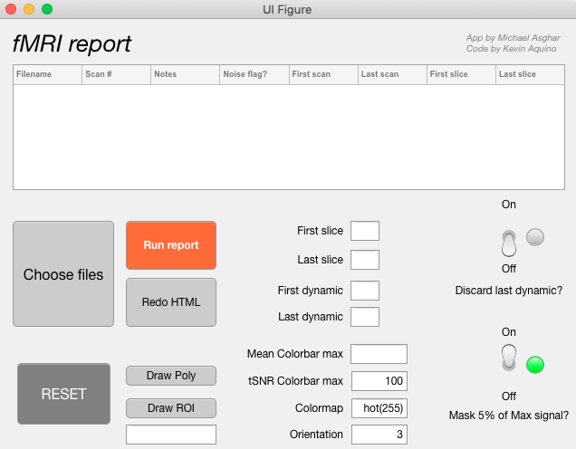

# README.md
## qa - quality assurance of fMRI data  

### What is this?  
* A MATLAB-based toolbox to allow quick and easy temporal signal-to-noise-ratio analysis of routine brain/fMRI NIFTI data.
* This is important to ascertain the stability of the scanner, and benchmark the quality of your raw data before any further processing.

### How do I run it?
* `git clone` the repo (or copy the zipped version) and make sure the folder is on your MATLAB path.
* There are 2 options for how to run `fMRI_report`:
	1. If your MATLAB version is **2016a** or later, then in the command window type `fMRI_report_app`
	2. If your MATLAB version is older than **2016a**, then type `fMRI_report`

* In both versions, you will select fMRI data and generate mean images and tSNR maps. The difference is that `fMRI_report` was written using old-school GUIDElines, whereas the newer `fMRI_report_app` version has the same functionality but is now in the form of a more user-friendly app, especially for debugging/portability etc.



--------------------

### OLD NOTES

### PSIR

provides the files / example for calculating PSIR images on the console. we'll use this as a starting point for getting the code in ``fmriQA`` to run / do the right thing.

### how to run?

- on PRIDE / the Philips scanner
- straight from ``matlab``
- in shell wrapper


### desiderata

We may also want to be able to run this in one of the following ways:

```matlab
  uonQA() % allow data file picking.
  uonQA('test_data_set01.nii') % NIFTI-1
  uonQA('test_data_set01.img') % NIFTI_PAIR
```

Wrapped in a shell script? If ``matlab`` is available from command line:

```bash
matlab -nodisplay -nodesktop -r "run /location/on/machine/uonQA.m"
```
( See e.g. http://uk.mathworks.com/matlabcentral/answers/29716-running-matlab-script-through-unix-bash-script )

We want the the program to output some basic info on
  - tSNR - voxel-wise temporal SNR \frac{\mu_t}{\sigma_t}
  - auto-picked ROI, given size, # of voxels?